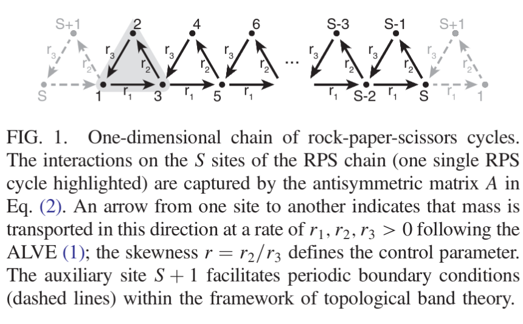
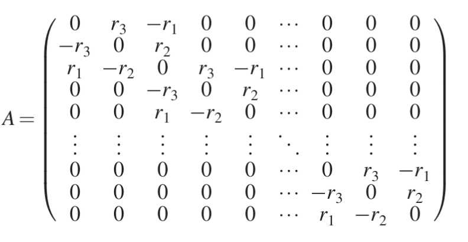
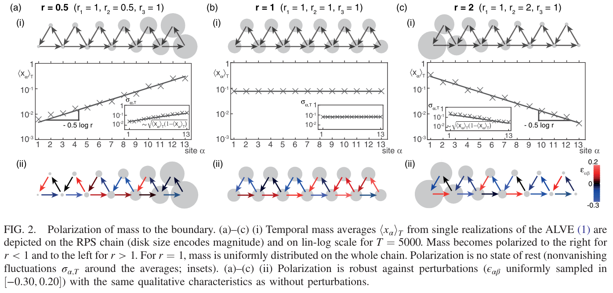

## Method

首先我们重复了 2020 年发表在 PRL 上，并被选为编辑推荐的论文：Topological Phase Transition in Coupled Rock-Paper-Scissors Cycles

本论文使用了演化博弈论的模型，使用了洛特卡-沃尔泰拉方程（别称捕食者与猎物方程）来描述石头剪刀布博弈中的现象。

如下图，我们研究的对象可以看作一条一维链，每个端点代表了持同一个策略的人群，按照一定的周期性排列，例如端点 1，2，3，4 分别代表持石头、剪刀、布、石头的一个人群，各个端点有人数这个属性。各个边代表了这两个人群之间存在着博弈的关系，两方的损益由边的有向权重来表示，例如 r1，r2，r3 表示人群 1，2，3 之间互相博弈的收益情况。

可以使用一个方程来描述这个博弈的演化过程，此方程在 1925 和 1926 年由洛特卡和沃尔泰拉独立发表，经常用于描述生态系统中捕食者和猎物的数量演化关系。方程的形式如下：

$$
\frac{d}{dt}x_\alpha = x_\alpha \sum_{\beta=1}^{S}a_{\alpha\beta}x_\beta, \ \ \alpha = 1, ..., S.
$$

其中系数 $a_{\alpha\beta}$ 可以组成一个反对称矩阵 $A=\{a_{\alpha\beta}\}_{\alpha, \beta}$，例子如下：

这代表了每个人群的人数变化受到其他人群的非线性影响，此影响正比于人数 $x_\alpha x_\beta$，和损益关系矩阵 A。

物理中的拓扑相有如下的性质：

1. 局部性：动态激励局限在系统的边界处。
2. 鲁棒性：在系统的参数变化、加入噪声等影响因素下，边模仍然能保持稳定。
3. 相变：在拓扑相之间的相变点，动态模式将会扩展到整个系统。

…… 决定了系统的拓扑相，而 …… 又由系统的对称性分类。

// TODO: nontrivial topological property of the system's bulk 啥意思？

下图是在这个一维石头剪刀布博弈链，简称为 RPS 链，上出现的拓扑相变现象。我们重复了论文中的实验，得到了相同的结果。

模型中边权 r1, r2, r3 均大于 0。将 r1 设为标准值 1，比例 $r := \frac{r_2}{r_3}$ 为系统的控制参量，称为偏度（skewness）。RPS 链上的每个石头-剪刀-布单元是一个非线性局部振子，人数在其中转移，因此整条链可以看作一组一维非线性振子所构成的链。当 $r \neq 1$ 时，人数在一个局部单元中的迁移是不均衡的。

// 百姓洋人官？（王朝兴衰、土地兼并）

论文中的实验给出了如下的结果：
1. 无论初值如何设置，人数最终都会集中在链的左侧或者右侧。
2. 这个极化过程在系统参量变化以及噪声的加入中都保持鲁棒，仍然会发生。
3. 在左极化和右极化的相变过程中，总人数扩散到整条链上，并且观察到了孤波。

